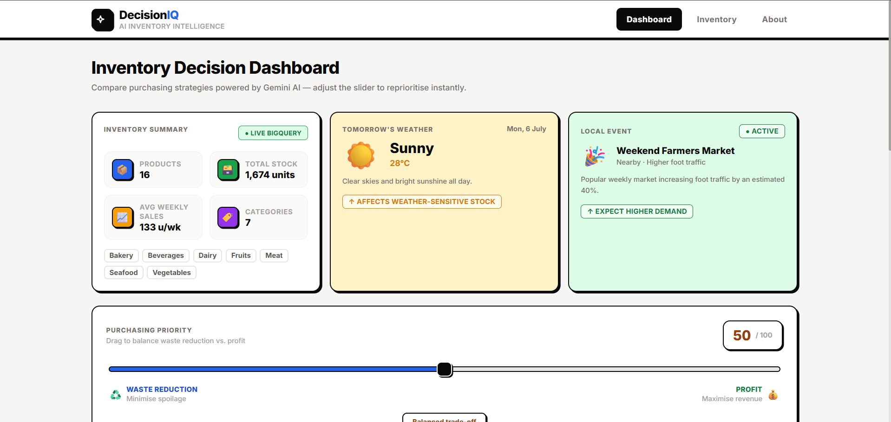

# DecisionIQ — AI-Powered Grocery Inventory Decision Simulator

<div align="center">
  <p><strong>Google Gen AI Academy APAC Hackathon · Cohort 2</strong></p>

  <p>
    <a href="https://decisioniq-501506-f6f79.web.app/"></a>
    <a href="https://drive.google.com/file/d/1kRNAHsK79xIWZq0i7rKvLyBcIMsznQRL/view?usp=drive_link"></a>
    <a href="DecisionIQ_Final_Submission.pptx"></a>
    <a href="https://github.com/mithunrajmr/DecisionIQ"></a>
  </p>

  <p>
    
    
    
    
    
    
    
    
    
  </p>
  
  <h4>An interactive AI decision intelligence platform that helps small grocery store owners simulate multiple inventory purchasing strategies, compare trade-offs, and place optimal orders.</h4>
</div>

---

## 🎯 Why DecisionIQ? (The Business Problem)

### The Dilemma
Small grocery store owners lose thousands of dollars each month due to two competing inventory errors:
1.  **Spoilage and Waste:** Ordering too many perishable products (like fresh bakery, seafood, or vegetables) that expire before they can be sold.
2.  **Stockouts and Lost Sales:** Under-ordering, resulting in empty shelves, missed revenue, and disappointed customers when demand peaks due to local events or sunny weather.

### The Solution
**DecisionIQ** bridges this gap. It is **not** a chatbot, a basic visual dashboard, or a standard time-series forecaster. It is an **interactive decision simulator**. 

By moving a single **Purchasing Priority Slider (Waste ↔ Profit)**, owners can instantly evaluate three distinct purchasing strategies. Supported by Vertex AI Gemini, the platform dynamically analyzes live BigQuery stock levels, shelf-life constraints, weather forecasts, and local foot traffic events, transforming raw data into clear, explainable business decisions.

---

## 🚀 Project Highlights & Core Values
*   🔗 **Live BigQuery Integration:** Operates directly on a real operational BigQuery dataset, supporting full, instantaneous inline DML CRUD operations.
*   🧠 **Explainable AI (XAI):** Generates plain-English trade-off explanations detailing exactly *why* a purchasing strategy is recommended, tracing metrics back to live inventory parameters.
*   📊 **Real-time Inventory Analytics:** Computes high-level KPIs, health alerts (e.g. spoilage risks, low stocks), and generates interactive category distribution charts.
*   💡 **Grounded Next Actions:** Translates high-level strategy choices into 3 immediate, data-grounded execution steps.
*   ☁️ **Cloud Native & Scalable:** Fully dockerized FastAPI backend running on Google Cloud Run with Application Default Credentials (ADC) and React frontend deployed to Firebase Hosting.

---

## 🖼️ Application Screenshots

### 1. Main Decision Simulator Dashboard


### 2. Live Inventory Analytics & CRUD Console


### 3. AI Explanation & Next Action Panel


### 4. Live CRUD Edit & Status Console


---

## 🔄 End-to-End Workflow Diagram

```
+---------------+           +---------------+           +-----------------------+
|  Store Owner  |           |   React App   |           |    FastAPI Backend    |
|               |           |  (Vite + Tailwind)    |   |      (Cloud Run)      |
+-------+-------+           +-------+-------+           +-----------+-----------+
        |                           |                               |
        | 1. Slide Priority Slider  |                               |
        +-------------------------->+                               |
        |                           | 2. POST /generate-scenarios   |
        |                           +------------------------------>+
        |                           |                               | 3. Query Stock Stats
        |                           |                               +-------------------+
        |                           |                               |                   |
        |                           |                               |<------------------+
        |                           |                               | (Google BigQuery)
        |                           |                               |
        |                           |                               | 4. Process Context & Prompts
        |                           |                               +-------------------+
        |                           |                               |                   |
        |                           |                               |<------------------+
        |                           |                               | (Vertex AI Gemini)
        |                           |                               |
        |                           | 5. Return Strategies (JSON)   |
        |                           |<------------------------------+
        |                           |                               |
        | 6. Render strategy cards  |                               |
        |<--------------------------+                               |
        |                           |                               |
        | 7. Select & Confirm Card  |                               |
        +-------------------------->+                               |
        |                           | 8. Log confirmed action       |
        |                           +------------------------------>+ (Save local / BQ)
        v                           v                               v
```

---

## ⚙️ Key Feature Specifications

| Feature | Description | Business Impact |
|---|---|---|
| **Purchasing Priority Slider** | Dynamic Waste Minimization (0) to Profit Maximization (100) slider. | Re-ranks and recalculates orders live based on risk appetite. |
| **AI Scenario Comparison** | Live side-by-side card layouts for *Conservative*, *Aggressive*, and *AI Recommended* plans. | Enables store owners to visually compare order units, costs, and risks. |
| **Explainable AI Panel** | Traces ordering suggestions back to inventory averages, shelf-life, and weather. | Eradicates black-box AI doubt, providing full logic transparency. |
| **Grounded Next Actions** | Generates 3 immediate execution prompts under the strategy card. | Operationalizes raw metrics into concrete immediate tasks. |
| **Decision History Drawer** | Chronological collapsible drawer saving confirmed decisions to `localStorage`. | Retains historical context for post-mortem analysis. |
| **Decision Detail Modals** | Clicking a history entry opens a full overlay detailing weather, events, and AI summaries. | Allows reviewing and verifying original logic weeks after ordering. |
| **Stat Cards & Live Health Alerts** | Alerts highlighting low stock, high spoilage, and sensitive items. | Surfaces silent inventory losses before they occur. |
| **Inline BigQuery CRUD** | Add, edit, or delete items directly from the table console. | Supports instant, live operational stock updates. |

---

## 🏗️ Google Cloud Production Architecture

```
                       +---------------------------------------+
                       |      Firebase Hosting CDN Nodes       |
                       |       (React Client SPA Build)        |
                       +-------------------+-------------------+
                                           |
                                           | HTTPS REST Requests (Axios)
                                           v
                       +-------------------+-------------------+
                       |       Google Cloud Run Instance       |
                       |       (FastAPI backend Container)     |
                       +---------+-------------------+---------+
                                 |                   |
                                 | Read/Write DML    | Vertex AI SDK
                                 v                   v
                       +---------+---------+ +-------+---------+
                       |  Google BigQuery  | |   Vertex AI     |
                       |   (Inventory DB)  | | (Gemini 2.5 SDK)|
                       +-------------------+ +-----------------+
```

---

## 📁 Repository Structure

```
decisioniq/
├── backend/                    # Python FastAPI API Services
│   ├── api/                    # Route endpoints (health, inventory, context, scenarios, explanation)
│   ├── credentials/            # Local service keys (ignored in Git)
│   ├── models/                 # Pydantic schema definitions
│   ├── prompts/                # Configurable Gemini system prompts
│   ├── services/               # BigQuery, Vertex AI, and Scenario Logic singletons
│   ├── utils/                  # Safe validators and logging formatters
│   ├── .env.example            # Backend env template
│   ├── main.py                 # FastAPI application router & CORS configuration
│   └── requirements.txt        # Managed Python dependencies
│
├── frontend/                   # React SPA
│   ├── public/                 # Static assets
│   ├── src/
│   │   ├── components/         # Neo-Brutalist modular components (Header, Footer, Cards, Modals)
│   │   ├── hooks/              # Custom React hooks (useFetch, useDashboard, useDecisionHistory)
│   │   ├── pages/              # Page layouts (Dashboard, Inventory, About)
│   │   ├── services/           # Axios endpoints matching backend routes
│   │   └── App.jsx             # React routing & core layout
│   ├── .env.example            # Frontend env template
│   ├── vite.config.js          # Dev proxy and server settings
│   └── package.json            # Managed frontend dependencies
│
├── data/
│   └── seed_bigquery.sql       # BigQuery schema setup & seed rows
│
├── Dockerfile                  # Production multi-stage Docker build
├── .dockerignore               # Docker build exclusions
├── .gitignore                  # Git repository exclusion rules
├── .env.example                # Root-level configuration template
└── README.md                   # Technical documentation
```

---

## ⚙️ Environment Variables

### Backend Environment Configuration
Create `backend/.env` based on `backend/.env.example`:
```env
GOOGLE_CLOUD_PROJECT=your-gcp-project-id
PROJECT_ID=your-gcp-project-id

VERTEX_LOCATION=us-central1
VERTEX_MODEL=gemini-2.5-flash

DATASET_NAME=decisioniq
TABLE_NAME=inventory_data

# CORS Config (comma-separated origins)
ALLOWED_ORIGINS=http://localhost:5173

# Allowed fallback for local sandbox testing
ALLOW_ALL_ORIGINS=false

LOG_LEVEL=INFO
```

### Frontend Environment Configuration
Create `frontend/.env` based on `frontend/.env.example`:
```env
# Leave empty in development to automatically use the Vite proxy (/api -> localhost:8000)
VITE_API_URL=
```

---

## 🚀 Setup & Execution

### 1. BigQuery Setup
Run the SQL seed script in your BigQuery console to create the dataset and seed inventory data:
```sql
-- Create table and seed data
-- (See details inside data/seed_bigquery.sql)
```

### 2. Local Backend Run
1. Install virtual environment and activate it:
   ```bash
   cd backend
   python -m venv .venv
   .venv\Scripts\activate   # Windows
   source .venv/bin/activate # Unix
   ```
2. Install dependencies:
   ```bash
   pip install -r requirements.txt
   ```
3. Run the FastAPI server:
   ```bash
   uvicorn main:app --reload --port 8000
   ```
   *The backend will automatically fallback to local mock data if no GCP credentials are set.*

### 3. Local Frontend Run
1. Navigate to the frontend directory:
   ```bash
   cd frontend
   npm install
   ```
2. Start the Vite dev server:
   ```bash
   npm run dev
   ```
   Open `http://localhost:5173` to interact with the application.

---

## ☁️ Cloud Run Deployment

### 1. Build and Push backend Docker image:
```bash
gcloud builds submit --tag gcr.io/YOUR_PROJECT_ID/decisioniq-backend .
```

### 2. Deploy Backend to Cloud Run:
```bash
gcloud run deploy decisioniq-backend \
  --image gcr.io/YOUR_PROJECT_ID/decisioniq-backend \
  --platform managed \
  --region us-central1 \
  --allow-unauthenticated \
  --set-env-vars GOOGLE_CLOUD_PROJECT=YOUR_PROJECT_ID,VERTEX_LOCATION=us-central1,ALLOW_ALL_ORIGINS=true
```

### 3. Deploy Frontend (Firebase Hosting):
1. In `frontend/.env`, set `VITE_API_URL` to point to your deployed Cloud Run URL:
   ```env
   VITE_API_URL=https://decisioniq-backend-xxxxxx.run.app
   ```
2. Run the production build command:
   ```bash
   npm run build
   ```
3. Host the compiled `dist/` folder using Firebase Hosting or any CDN provider.

---

## 🔌 API Documentation

| Endpoint | Method | Description |
|---|---|---|
| `/health` | `GET` | Container liveness check |
| `/context` | `GET` | Fetches tomorrow's simulated weather & event context |
| `/inventory` | `GET` | Returns aggregated statistics and item details from BigQuery |
| `/inventory` | `POST` | Adds a new product to BigQuery |
| `/inventory/{product_name}` | `PUT` | Updates details of a product in BigQuery |
| `/inventory/{product_name}` | `DELETE` | Deletes a product from BigQuery |
| `/generate-scenarios` | `POST` | Generates 3 ranked scenarios using Gemini or rule-based engine |
| `/explanation` | `POST` | Generates a plain-English explainable AI summary for a selected strategy |

---

## 🗺️ Future Roadmap
1. **Dynamic ERP integrations**: Direct connections to SAP, Oracle, and Shopify systems.
2. **Supplier APIs**: Automate purchase order submittals directly through supplier API catalogs.
3. **Autonomous purchasing agents**: Authorize AI to make micro-purchases under strict cost caps.
4. **Predictive demand forecasting**: Incorporate historical multi-year seasonal sales history.

---

## 👨‍💻 Developer & Team

**Mithun Raj M R**
*   **Role:** Software Engineer
*   **Program:** Google Gen AI Academy APAC Hackathon (Cohort 2)
*   **Portfolio:** [mithunrajmr.netlify.app](https://mithunrajmr.netlify.app/)
*   **GitHub:** [github.com/mithunrajmr](https://github.com/mithunrajmr)
*   **LinkedIn:** [linkedin.com/in/mithunrajmr](https://www.linkedin.com/in/mithunrajmr)
*   **Email:** [mrmithunraj07@gmail.com](mailto:mrmithunraj07@gmail.com)

---

## 📄 License
This project is proprietary and built strictly as part of the Google Gen AI Academy Hackathon submission.
